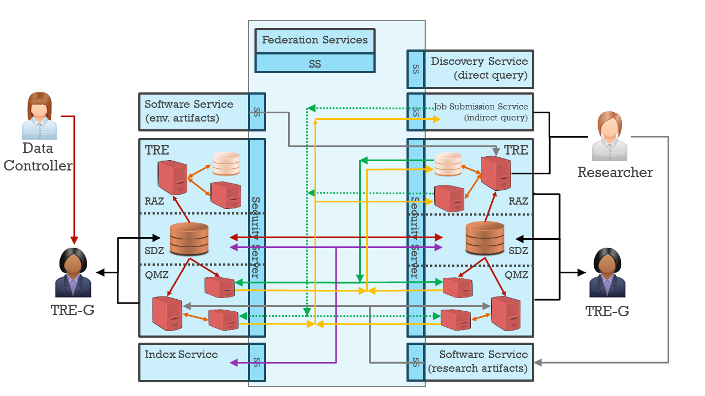

> [DARE UK Federated Architecture Blueprint](../)  v2.2
----

# Chapter 1 Executive Summary

> “All models are wrong, but some models are useful.”
- George E.P. Box

##  Overview

Research with sensitive data already happens in the UK, in pockets of good practice connected by ad hoc
technical processes. Alongside “classic” sensitive data from health and government sources there is
increasing research interest in bringing other kinds of data into a common framework. This fragmented
landscape suffers from attendant frictions and bottlenecks in data sharing and is a significant drag on
researcher productivity.

Analytics services for researchers working with sensitive data are typically—and increasingly—provided in
trusted research environments (TREs), secure computer systems wrapped in information governance
practices and processes modelled on the Five Safes approach developed by the Office for National
Statistics ([ONS](https://www.ons.gov.uk/)). 
These cast the technical systems needed to support sensitive data research as one part
(the “safe setting”) of a broader set of procedures designed to manage risk and create an overall
trustworthy environment.

To introduce standardisation and additional trustworthiness to the existing – and future – network of
TREs and data providers, we propose the idea of a Secure Data Research Infrastructure Federation, with
three key capabilities:

- common, standardised security and privacy controls for individual TREs and other participating
    services;
- common, standardised collaborative data communication between participating services;
- a common TRE trust domain, including certifications and required levels of compliance.

Together these capabilities create a backbone for secure information exchange between all participants,
with strong guarantees of confidentiality, integrity and availability. By this means we can connect TREs,
data providers and other service providers together in a high-assurance network with common trust and
strong governance oversight.

Running on top of this backbone we envisage a set of application services in a small number of different
classes. We identify needs for service classes for:

- the exchange of data extracts;
- the exchange of linkage spines;
- the exchange of queries and results;
- and the download of approved software from controlled sources.

We deliberately discuss these services in the abstract, as classes of interfaces exchanging structured
documents in separately secured contexts. In this way we seek not to over-specify what functionality an
innovative network of TREs can and cannot offer but rather to highlight the need for descriptive
metadata standards for a range of entities and concepts within the federation network.

Governance of the overall Federation follows the same principles as the technical approach: augment
what is already in place without disrupting it. We highlight the key relationships and accountabilities
within the proposed Federation, and introduce first ideas for the process-set necessary to govern a UK-
wide federation for sensitive data research.

## 2. [The strategic case for federation](../2_Strategic_Case/2_1_Introduction.md)

The needs of independent information governance (for instance, between the four nations of the UK) and
the practicalities of data movement in some cases (in large environmental datasets, for example) mean
that data will and should remain distributed. On the premise of a sensitive data landscape that is
distributed we accordingly propose a federated approach to connecting TREs and other services together
in a way that is standardised but as minimally intrusive to the good practice already in use.

In our context, we use federation in its broadest sense of connecting organisations together under a
common set of rules and standards. This provides the framework for research patterns which either
involve moving analyses to distributed datasets (“**federated analytics**”) or moving datasets into a single
location for analysis (“**data pooling**”). We observe that the Federation must support both.

In parallel with the development of this architecture the DARE UK programme has supported **five “driver
projects”** , each of which explored possible technologies and tools that could be used in later
implementation work. We summarise these briefly and describe their impact on version 2.0.

## 3. [Users and use-cases](../3_Users_And_Use_Cases/3_1_Introduction.md)

We introduce **ten user personas** derived from hosted workshops in 2022 and 2023, representing
archetypal users, from research through TRE service provision to data custodianship and including a
“member of the public” persona. From these personas we enumerate **61 high-level user stories** as sources
of requirements for TREs, data providers and the Federation itself.

We observe that both current practice and future use will require an architecture that supports both the
data pooling and federated analytics patterns.

## 4. [Federated architecture: infrastructure layer](../4_Infrastructure_Layer/4_1_Introduction.md)

The picture below is a simplification of the detailed infrastructure diagram from Chapter 4 and illustrates
the essence of the Federation.

Federation Participants are shown in blue: TREs and supporting services. We show two **TREs** , two
**Software Services** and one each of **Index** , **Job Submission** and **Discovery** for illustration. In the actual
Federation there will be many of each kind, specialising in different kinds of data or analytical capability.

The core of the SDRI Federation sits between the other services, with connections shown between the
standardised **Security Servers** at each Participant, plus a single group of **Federation Services**. This core of
Federation Services, Security Servers and connections together define the Federation. The Federation
Services group comprises services for registry (of services, users, projects, etc.), trust (security certificate
management and signing), management (of standard shared software), monitoring and accounting.

|  |
| ---- |
| _Figure 1. Simplified architectural sketch of the Sensitive Data Research Infrastructure Federation. Trusted Research Environments are denoted “TRE”. TREs are divided logically into three internal zones: a Research Analytics Zone (RAZ), a Secure Data Zone (SDZ), and a Query Management Zone (QMZ). Not all zones need be present in any given TRE.“SS” = Security Server, a secure common gateway for all inter-TRE traffic. “TRE-G”, TRE Governance, is shorthand for all those responsible for the security and integrity of running a TRE._ |

Different-coloured connections between Participants are shown, with the colours representing the
different types of connections allowed within the Federation. Note that these connections run directly
between Participants, not through any Federation Services hub. The Federation control plane and data
plane are independent, touching only at individual Participants’ Security Servers.

The arrows in the diagram are significant and indicate the direction of flow of information.

Green connections allow Participants to send “queries” to other Participants. These “queries” come in two
forms: “direct queries” (solid green) which include all the necessary information for the query receiver to
run it (an SQL statement, for example); and “indirect queries” (dotted green) which indicate that a TRE
needs to download additional software (workflows, scripts or containers, for example) in order to execute
it. Queries are, of themselves, unlikely to be disclosive and so may be treated with low levels of disclosure
control.

Orange connections represent the responses returned by queries. While typically thought of as aggregate
summaries, results do have the potential to contain disclosive information, depending on the query sent
and the dataset queried. While results would only ever be sent through secure gateways (Security
Servers) to other approved Participants within the closed Federation network, disclosure controls may be
appropriate for certain kinds of results.

Red connections allow Data Controllers and TREs acting as data providers to send datasets and data
extracts to governance authorities in TREs in standard, secure ways^2. Sensitive personal data are de-
identified and approved for use in research but are nevertheless potentially disclosive and, despite the
above remarks about secure gateways and closed Federation network still applying, disclosure controls
are appropriate for red connections.

The other connections shown are purple for index services, which create linkage spines for data linkage,
and grey for software artifacts delivered by software services (the workflows used in indirect queries are
an example).

The architecture only specifies what is strictly necessary to meet the needs of the different methods of
federation described in Chapter 3: data pooling, and federated analytics with both direct and indirect
queries. To this end our model of a TRE has three distinct zones: a **research analytics zone** (RAZ), a **secure
data zone** (SDZ) and a **query management zone** (QMZ). We observe that not every TRE need support
every zone.

We conclude this chapter with definitions of some additional key concepts, including **projects**, **identities**
and **authorisation**.

## 5. [Federated architecture: data layer](../5_Data_Layer/5_1_Introduction.md)

We provide a simple cross-comparison of current data classification schemes (e.g. GDPR, UK
Government) mapped to a single seven-point scale which could be used as a standard designation across
the Federation.

The introduction of registry services raises the need for a **common metadata model** of the Federation
itself. In discussing this we use the same layering as the architecture itself and produce the following
model:

Federation metadata: what the Federation actually _is_ , comprising:

- Infrastructure metadata: what the service layer looks like, comprising:
    o Descriptive metadata: static information about Participants, their service types, capabilities
       and so on.
    o Operational metadata: dynamic information, especially logging data from Security Servers.
- Content metadata: what “content” is in the Federation, comprising:
    o Dataset metadata: high-level (catalogue-level) information about each dataset available for
       potential research use within the Federation.
- Governance metadata: who has access to Federation assets for what purposes, comprising:
    o Project metadata: information defining each current or completed research project.
    o User metadata: information about each user of the Federation, the roles they have, the
       approvals they have, the Projects they are members of, and so on.
    o Data Extract metadata: information about subsets or extracts of Datasets as used in
       Projects.

**NB** Throughout, we use “TRE Governance” as a shorthand for the team of people charged with running a TRE,
including technical administrators, data analysts, statistical disclosure control experts and other information
governance professionals.

Where possible we illustrate these concepts with examples drawn from existing sources, notably the
metadata records required of services seeking to acquire accreditation as data processors under the
Digital Economy Act 2017.

We observe that the creation of a single registry with this kind of metadata model also enables some
form of **publicly accessible presentation** of what research projects are active right now, using which
datasets – with obvious exciting opportunities for greater public transparency.

Strictly speaking, the Federation metadata model introduced here should define the limit of our scope
with respect to any broader discussion of data standards. Nevertheless, we go on to discuss a number of
concepts that will be the focus of Discovery Services and Index Services (q.v.) yet to be developed.

We use the FAIR principles of findability, accessibility, interoperability and reusability to frame this
discussion.

For **findability** we recommend agreeing and adopting within the Federation existing standards for high-
level metadata, highlighting current recommendations from UK Government and National Health Service
sources: DCAT, schema.org, Dublin Core, UPRN, ISO 8601, OMOP, and so on.

For **accessibility** we highlight the need to find the right mix of data pooling vs federated query for
complex projects. Projects involving initial, iterative “exploratory data analytics” on small-scale data
samples are difficult to realise in a purely federated analytics environment, for instance.

For **interoperability** we focus on data linkage and discuss three areas of increasing challenge to
automating linkage and Index Services across the Federation. This kind of categorisation should support
incremental development of discovery and indexing services of increasing sophistication.

For **reusability** we observe simply that reuse of sensitive data from one project in another is much more a
governance question than a technical challenge.

## 6. [Federated architecture: organisational layer](../6_Organisational_Layer/6_1_Introduction.md)

We note that the design of the operational model of the Federation must be **community-led** , and the
organisational structures of the Federation must be comprised of the set, or an agreed core sub-set, of
the Federation Participants (TREs and their governance bodies, other services).

We introduce the idea of a **Federation Authority** (FA) as an oversight body, and discuss the pros and cons
of delivering different aspects of the FA’s functions through **centralised**, **distributed** or **decentralised
models**. We draw no conclusions but offer this up as a starting point for broader community dialogue.

----

