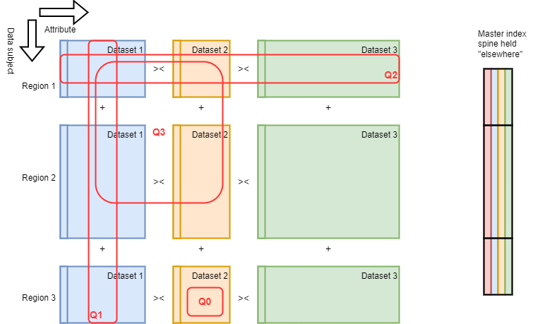

# DARE UK Federated Architecture Blueprint - Part 2 (Strategic Case)

## 2. The federation challenge

While there are many ways to define “sensitive data”
one important definition is “individual-level public
data”, and particularly individual-level data defined as
“special category” under the UK GDPR [36] (electronic
health records, for example). The UK has rich sets of
data about its citizens, both collected routinely
through citizens’ interactions with government, health
bodies and other administrative centres, and collected
voluntarily through clinical trials, survey responses and
so on. Making these data available for research at
population scale, in joined-up ways, has tremendous
potential for public good (see box right^1 ). But
whatever the source, any use of public data for
research must have public trust, and benefit, at its
heart.

The need to connect distributed data and distributed
analytics services requires a federated approach: a
common set of protocols and standards agreed by all
participants enabling the “intelligent” exchange of data
for research [5] and increasing the prospects of safe
automation across the landscape. To enable the
exchange of sensitive data—in particular public data—
the federation must be trustworthy.

----

_The first, but not the last_

In January 2024 the COALESCE consortium
published the UK’s first whole-population
analysis [4]. The study, of covid-19 under-
vaccination and severe outcomes, was a
meta-analysis across the separate,
independent TREs of the UK’s four nations:
the NHS England Secure Data Environment,
the Scottish National Safe Haven, the SAIL
Databank in Wales and the Northern Ireland
Honest Broker Service. The meta-analysis
method meant that comparable statistical
analyses were performed separately inside
each TRE, and the resulting statistics were
knitted together afterwards. The study had
to overcome challenges of data
harmonisation and scale in four different
ways, across four different secure
environments.
One key goal of a technical and
organisational federation of the UK’s TREs is
to make future studies like COALESCE much
easier to conduct.

[More information on the ground-breaking COALESCE study](https://www.ed.ac.uk/usher/eave-ii/connected-projects/coalesce/uk-first-whole-population-analysis)

----

One aspect of the challenge we cannot ignore is that
we do not start from scratch. The UK has a significant
number of TREs, already delivering real scientific advances, as COALESCE illustrates. Any federation
architecture must recognise the existing service infrastructure, whilst enhancing its trustworthiness and
creating an environment where common standards create a platform for continued innovation.

Using this approach we derive three essential use-cases:

1. Data pooling, where approved datasets or data extracts are moved between TREs, pooled in a
    single location and optionally linked, before being provided to a research team as a project.
    Analysis tools and resources are provided at the pooling location to support the project.
2. Federated analytics, where approved datasets are held in situ and analytical “queries” are split into
    parts that can run independently on each of the remote datasets. This is further divided into:
       a. Direct query, where an analytical query sent to the remote datasets is fully encapsulated in
          the request object and contains everything needed to execute the query on the data; and,
       b. Indirect query, where an analytical query sent to the remote datasets contains references
          to additional computational workflows, scripts or other software that must be downloaded
          from another service before the query can be executed.

Since our interest is in the federation of TREs and data providers at the organisational level we do not
consider the details of data provision to researchers within a TRE.

### 2.1. Conceptual data space

We can bring these ideas together into a conceptual data space where different kinds of dataset are
divided across different regional data custodians. Each block in Figure 1 is conceptually held by a
different organisation.

This division works particularly well when
considering individual-level health or
administrative data which are held locally
or regionally (by local authority or by health
board, for instance). Generally, we assume
there is a population of interest, defined by
some primary key, which is divided into
discrete regions. Within each region are a
number of disjoint datasets about each
population subset.

With the primary key running row-wise,
partitioning the overall dataspace
horizontally results in a number of sub-
populations with common attributes.
Partitioning vertically splits the attribute space for the whole population. Doing both creates the picture
in Figure 1.

| _Figure 1. Conceptual dataspace for DARE UK_ |
| ---- | 
|  |

The reality of data combination is much messier than this picture suggests, of course; nevertheless a
conceptual abstraction at this level is useful in categorising use-cases and identifying common
requirements and functionality within a broad architecture. In particular it helps us characterise query
patterns across the different dimensions, and hence understand what federation mechanisms will be
needed to enable them. Figure 1 highlights four basic query patterns:

Q1: a query across a single dataset but spanning multiple regions to include a larger population than is
available at any individual data custodian. Queries of this kind can be run independently in each
region and the results combined trivially.

Q2: a query across the population of a single region but spanning multiple datasets. Queries of this
kind (probably) cannot be run independently on each dataset but (probably) require the joining of
schema-wise-different datasets by some kind of key representing individuals.

Q3: a query combining the complexity of both Q1 and Q2, requiring joins across multiple datasets and
combination across multiple regions.

For completeness there is also:

Q0: a query within a single regional dataset.

These high-level data patterns give rise to number of requirements that we note below.

### 2.2. Data pooling

The data pooling pattern occurs more often in
current use. Here datasets are often vertically
partitioned and need to be linked together using a
common “master index” (I 123 ). The index is created by
a trusted third-party “index service” in a way that
ensures that the resulting linked dataset (D 123 ) is only
ever created within the analysis TRE.

This pattern is needed to combine different kinds of
data using a common spine such as individual-level
identifiers, universal property reference numbers etc.
and requires careful governance of both datasets and
indexes.

### 2.3. Federated analytics

The federated analytics pattern works very well when data are horizontally partitioned but otherwise
uniform (e.g., census data divided by region). It can be made to work when data are vertically partitioned,
although it is technically more challenging to include the additional index service needed to make the join
between the remotely calculated query results. In either use, the underpinning premise of the Federation 
-- a trustworthy network between Participants -– enables the exchange of queries and results in the
context of an approved Project to happen without the need for “Federation-internal” disclosure control.
All analytical queries and all results are maintained within the secured Federation network, and only move
between TREs or other equivalently secured services.

Federated analytics can also be used as a mechanism to create Discovery Services (cf. Part 4
(Components)) which support distributed metadata discovery from _outside_ the Federation – although
because this usage connects internal Federation queries to the outside world, Discovery Services must be
designed with disclosure control in place and with careful governance oversight.

#### 2.3.1. Direct query

Of the two federated analytics patterns the direct query
pattern is the simpler but covers the fewest concrete
use-cases. Here, datasets (D 1 , D 2 and D 3 ) remain within
their data provider organisations (“data TREs” 1, 2 and 3)
and queries across them are sent from a project within
an “analysis TRE”. The data TREs need to have the
capability to handle the queries. Responses are returned
to the project but not necessarily synchronously: query
responses may need to be disclosure checked before
they are permitted to leave the data TRE.

The “query” here is fully encapsulated in the request
from the analysis TRE; no additional information or external software is needed by the data TREs to
execute the query. The actual query may be simple (e.g., an SQL COUNT) or it may be a complex object
containing partial training results from a machine learning model needing additional disclosure checks, but
in all cases it must be fully encapsulated in the Query Object as received by the data TREs.

An example implementation of direct query can be found in the TELEPORT project [29]. TELEPORT uses
the Trino SQL execution engine^2 to connect remote data sources within one TRE to a “single pane of
glass” user-view in another. To the research user, this has the appearance, and consequent utility, of a
single database table, while behind the scenes queries and results are exchanged between participating
TREs.

#### 2.3.2. Indirect query

The indirect query pattern captures the use-cases
seen in federated analytics using job submission: a
job request is created by researchers on a project and
sent to participating “data TREs”. Again, the datasets
(D 1 , D 2 and D 3 ) remain within their provider
organisations. To execute the job query, the TREs
must download the actual “analytical payload” (a
workflow, for example) from another source, run it,
and return the response to the originating service.
(This download may need to be done in advance, and
the contents of the payload risk-assessed before it
can be executed within the TRE.) Each TRE must, of
course, have the capability to handle the queries.

As with direct query, responses are returned to the project but not necessarily synchronously: job
responses may need to be disclosure checked before they are permitted to leave the data TRE.

(^2) “Trino, a query engine that runs at ludicrous speed”. See https://trino.io/

An example implementation that support both indirect and direct query can be found in the TRE-FX
project [27]. TRE-FX uses the Hutch federated job execution software^3 , enabling researchers to request
the execution of complex workflows within participating TREs. The workflows can either be fully
encapsulated in the request object, mapping onto the direct query model, or be developed “out of band”
by a researcher, uploaded to a trustworthy repository and then downloaded and screened for safety by
operators at participating TREs, each acting independently and in accordance with their own risk profiles
and policies. In both cases TRE-FX uses the same standard approach for object exchange between TREs,
the RO-Crate packaging format (cf. Part 4 (Components)).

(^3) Hutch, a federated analytics execution agent. See https://health-informatics-uon.github.io/hutch/

