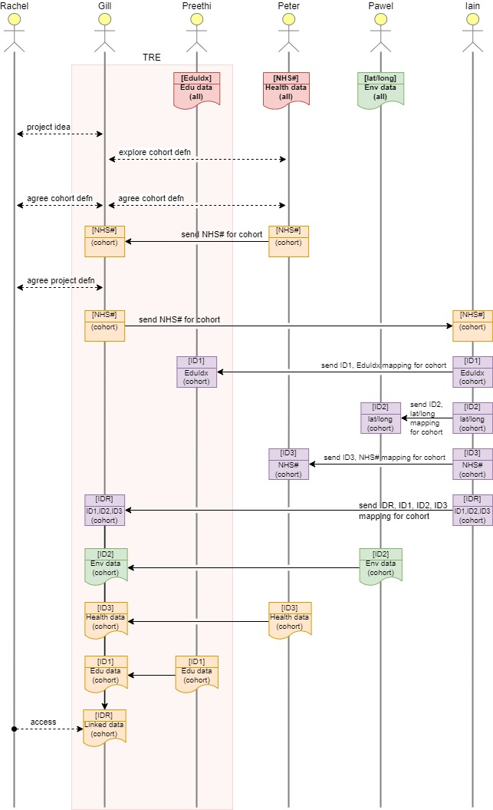

> DARE UK Federated Architecture Blueprint  v2.2
----

# Chapter 3 Users and use-cases
## Rachel’s journey: 2022

Where do we start from?

Rachel is a researcher. As an illustration of the different roles and processes that are currently
undertaken in setting up a research project with sensitive data, here is an account of her
journey from an idea to the start of a project built around that idea. The time is late 2022, the
setting our current sensitive data research landscape. We have a small cast of characters:

- Rachel, a researcher;
- Gill, an information governance professional in charge of a TRE;
- Iain, who provides an indexing service;
- Pawel, Peter and Preethi, three data providers.

We follow Rachel’s journey below and make observations as we go.

Rachel has a research question she’d like to explore: “understanding environmental health impacts on educational achievement”. She realises she’ll need to bring together different kinds of data to answer this.

> How does Rachel figure out what data she needs? Where does she look? How does she know whether the data she needs are stored as one, two or many datasets?

Rachel has identified three datasets she needs:
 - Education data, already collected by Preethi for the whole population and available for research in a TRE run by Gill.
 - Environmental data on air quality, groundwater quality—in fact loads of interesting variables—covering the whole country, collected by Pawel and all openly available for research.
 - Health outcomes, collected by Peter and available for research but only for particular cohorts. Rachel will have to ask explicitly for what she needs.

> Education data use a special index based on name, address and data of birth.
> Environmental data are indexed by location, typically latitude/longitude, and a shape that defines the area they cover.
> Health outcomes data are indexed by NHS number (NHS#).

Rachel understands she’ll need to conduct her research in a TRE. Seeing that at least one of her datasets of interest is already available in a TRE, she contacts Gill.

> Rachel knows who to ask but would another researcher know where to go next?

Gill works with Rachel to define the project, including identifying how disclosure control of project results will need to be managed, given the different risk appetites of the data providers involved. 

> Managing disclosure risk is a really important topic to get right, right at the start of a project.

Gill liaises with the three data providers, Preethi, Peter and Pawel. Peter’s health outcomes data is the biggest constraint; Peter can only release a specified cohort set for research so defining the cohort is key. Gill, Rachel and Peter work up a cohort definition for the project.

> Cohort definition is manual and iterative here; is there any technical way to speed it up or smooth it out?

Rachel and Gill have agreed a definition for the project:
 - Peter has approved the cohort of health outcomes data, indexed at individual level by NHS number (NHS#).
 - Preethi has approved access to the education data already within the TRE, already indexed at individual level with a unique “education data index”.
 - Pawel is happy to provide access to the environmental datasets for the areas inhabited by Rachel’s cohort. Pawel’s data can be indexed by latitude/longitude or equivalent geospatial coordinates.

> “Project” is a key concept. It ties together the researchers, the datasets they need and the approvals they have, for a certain period of time and for a specific purpose.

Gill now orchestrates data assembly for Rachel’s project within the TRE. Indexing the three datasets so they can be linked is key and she works with Iain, her trusted third-party indexer.

> Here we assume that one indexer has “lookup tables” for all the key private data.

Gill sends the set of NHS#s to Iain. Using the registers that he looks after Iain creates four lookup tables for the project:
> This approach is creating project-specific identifiers, which is good practice.

 - A set of “education data index” numbers mapped to a set of unique but meaningless numbers called “ID1”.
 - A set of latitude/longitude pairs mapped to a set of unique but meaningless numbers called “ID2”.
 - The original set of NHS numbers mapped to a set of unique but meaningless numbers called “ID3”.
 - A “master index” mapping ID1, ID2 and ID3 to a set of numbers unique to Rachel’s project called “IDR”.

> Some indirect mapping is required:
> - NHS# maps to name, address and date of birth which map to education index (Iain knows how because he created the education index in the first place!).
> - NHS# maps to an address which maps to a unique property reference number (UPRN) which maps to a lat/long pair.

Iain sends the ID1 and education index mapping to Preethi.

Iain sends the ID2 and latitude/longitude mapping to Pawel.

Iain sends the ID3 and NHS# mapping to Peter.

Iain sends the “master index” straight to Gill at the TRE. He uses an existing secure file transfer channel between his organisation and Gill’s TRE.

> None of these identifiers are particularly sensitive of themselves but nevertheless sending documents between different parties needs to be done securely.

Pawel prepares the environmental data using the set of lat/long pairs, but he replaces lat/long with ID2 in Rachel’s version of the dataset.

Pawel sends this dataset to Gill, marked “for Rachel’s project”. The dataset isn’t particularly sensitive so he emails it to Gill as an encrypted zipfile.

Peter prepares the health outcomes data extract using the set of NHS#s, but he replaces NHS# (and any other personally identifying attributes) with ID3 in Rachel’s version of the dataset.

Peter sends this dataset to Gill, marked “for Rachel’s project”. He does this using a managed file transfer service which is very secure but requires a bit of manual finessing at both ends.

> Sending datasets between different parties definitely needs to be done securely.
> Currently there are many different methods employed: managed file transfer of various kinds, secure email, occasional physical device transfer (a disk-drive passed literally form hand to hand).

Preethi chooses to prepare the education data as an extract using the set of education data indexes. She removes all the personally identifiable attributes and replaces each education data index number with ID1 in Rachel’s version of the dataset.

> Preethi and Gill could choose to allow Rachel access to the full education dataset and give her a lookup table matching education data indexes to the set of “IDR” indexes.

Gill uses the three datasets and the “master index” from Iain to zip everything together into Rachel’s final, approved linked dataset.

> The only index number left in the linked dataset is the “IDR” which is unique to Rachel’s project (and doesn’t mean anything to anyone else).

Rachel gets access to her approved linked data inside the TRE, and she’s off!
> Finally!

Figure 3 illustrates the above narrative as a sequence diagram, showing interactions and data and metadata movement between the actors. Metadata objects are rectangular and datasets are “document shaped”. The colour scheme follows that of Section 4.1.2. Time runs from top to bottom.

| _Figure 3. Rachel's Journey_ |
| ---- | 
|  |

Rachel’s research journey, while synthetic, is rooted very much in current “data pooling” practice of sensitive data research in the UK. It helps us tease out the key drivers for the SDRI Federation, and in doing this we take two perspectives. The first perspective comes from potential users of the federation, from researchers like Rachel to system operators and data custodians. The second comes from the existing landscape of services across the UK [1] and how they currently interact with each other—Gill’s TRE and Iain’s indexing service, for example. In both cases we have distilled community interactions, desk research and expert knowledge into a series of user personas on the one hand and data usage patterns on the other. We use these two perspectives to identify the key requirements for the SDRI Federation.

