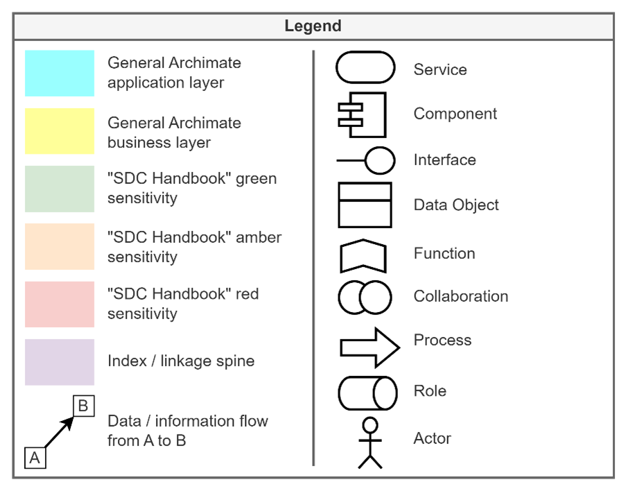

> DARE UK Federated Architecture Blueprint  v2.2
----

# Chapter 4 Federated architecture: infrastructure layer
## Overview

This blueprint draws on current best practice in secure data exchange environments but also reflects the design principle of “start from where you are”. This architecture proposes the minimum necessary new infrastructure to create the required trustworthy federation while causing the least disruption to TREs and data services already in use. It is also explicitly a “back end” architecture that connects TREs to other TREs. Adherence to the principle that all research with sensitive data take place within a TRE means that Researchers will interact only with TREs and never with the Federation infrastructure directly.

Figure 4 depicts the high-level architecture of the SDRI Federation. It shows a number of Federation Participants—TREs and supporting services—and indicates the principal information flows between them. For illustrative purposes we show two TREs and single versions of other services. In practice there will be more of each. A single set of Federation Services hold a record of all Federation Participants and provide a set of trust services that together create the required trustworthy environment.

## Notation
The diagrams follow the ArchiMate standard (version 3.1) [40] according to the following legend.

|  |
| ---- |

### Symbols
The diagram elements have their usual ArchiMate meanings (right-hand column) with the exception of connecting lines.
Solid connecting lines indicate channels of data or information flow, with arrows indicating direction. Importantly, the absence of an arrow indicates that there is no data flow in that direction.

Dotted lines indicate an (unspecified) relationship between the connected elements. 

### Colours

Yellow and cyan colours indicate elements in default ArchiMate architectural layers – the higher business layer and lower application layer respectively.

We use green, amber and red colours to indicate “data sensitivity” in the sense of potentially disclosive, aligning with the terminology used in the Statistical Disclosure Control Handbook [41].

Purple indicates indexing or linkage spine data, what might be termed “sensitive metadata”.

|  |
| ---- |
| _Figure 4. Architectural diagram of the infrastructure layer of the SDRI Federation network. The notation broadly follows the ArchiMate v3.1 standard [40], although we use colour in a different way (see above). Note that the scope of the core federation is captured in the central “yellow collaboration” element and associated “blue box” security servers. Please refer to the key above for definitions of the diagram elements._ |

