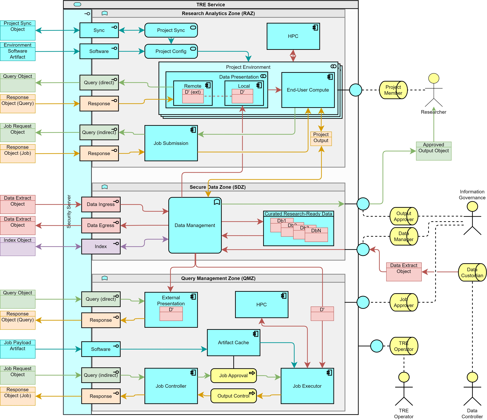

> DARE UK Federated Architecture Blueprint  v2.2
----

# Chapter 4 Federated architecture: infrastructure layer
## Participants
### Trusted research environment (TRE)

TREs are the main vehicles for delivering sensitive data to Researchers in secure, controlled and approved ways.

In developing this architecture we have tried to avoid specifying in too much detail what a TRE “is” and what it “isn’t”. Nevertheless, the linking of TREs into cooperating services capable of supporting federated analytics imposes certain requirements on the internal structures of TREs. We model this using a number of “zones” within a TRE (see Figure 5).
Different TREs can offer different capabilities, and so not every TRE needs to support the functions of every zone. Figure 5 illustrates the maximal TRE, which includes every zone.

|  |
| ---- |
| _Figure 5. An expanded view of the TRE service from Figure 4._ |

The zones are illustrated with gaps between them. This is deliberate: the zones require different levels of governance and approval for the roles accessing them, and in particular, movement of data between them should be subject to appropriate controls and potential “air-gapping” to manage the related disclosure risks.

#### Research Analytics Zone (RAZ)
This zone provides the means for a Project Member to gain direct access to the data their project is approved to use, in an environment suitable for the analyses their research requires. This is often realised as a virtual desktop environment, a computational notebook or similar. There is often a strict requirement that project environments be completely isolated from one another.

**NB:** A TRE need not have an RAZ. Instead it may operate as a pure data provider (with just a Secure Data Zone), or as a “headless” TRE able to run queries against data it hosts (with both a Secure Data Zone and a Query Management Zone).

An RAZ has a number of elements, not all of which need be present.

An RAZ MUST have one or more Project Environments. Project Environments MUST be suitable for the kinds of research the TRE supports and SHOULD be configured in standard and repeatable ways, modelled here by a relationship with a Project Config service. The Project Config service MAY connect to approved external software repositories, in which case the RAZ SHOULD support the [Software](4_4_Interface_Types.md#software) interface type.

A Project Environment MAY be provisioned and managed dynamically and kept in sync with an agreed and approved project state (the “pop-up TRE” model). This project state may be shared between a number of participating TREs (strictly, between the participating TRE Governance actors) and synchronisation may require continually maintained connections between the participating TREs, modelled as a control relationship between a Project Sync service and the Project Config service. In this case the RAZ MUST also support the [Sync](4_4_Interface_Types.md#sync) interface type.

Each Project Environment is a combination (modelled as a collaboration) of an End-User Compute component and a Data Presentation component. The Data Presentation component MAY be composed of a Local data view (e.g., a file), OR a Remote data view (e.g., a representation of a remote resource in a web browser), OR a combination of the two (e.g., a polystore representation of two or more databases).

If the RAZ supports Remote data views then it MUST support the outgoing 
[Query (direct)](4_4_Interface_Types.md#query-direct) and incoming 
[Response](4_4_Interface_Types.md#response) interface types (q.v.).

An RAZ MAY support indirect queries against remote TREs by providing a Job Submission component accessible directly from Project Environments. In this case the RAZ MUST support the outgoing 
[Query (indirect)](4_4_Interface_Types.md#query-indirect) and incoming 
[Response](4_4_Interface_Types.md#response) interface types (q.v.).

An RAZ MAY provide high-performance or advanced computing capabilities, modelled as an HPC component. This component SHOULD be accessible from the Project Environments and MAY be provisioned as a shared service, in which case special care must be taken in maintaining the strict isolation between projects.

The underpinning hardware for this component may overlap with – or indeed be the same as – the HPC component provided within a query management zone (cf. below). Its double inclusion in the diagram reflects the possibility of different modes of user access – interactive access directly from a Project Environment, or batch access via a job queue and potentially an internal Job Submission component.

#### Secure Data Zone (SDZ)

This zone supports the ingress, egress, management, linkage, curation and provision of research-ready sensitive datasets. TRE Governance actors with roles Data Manager and Output Approver SHALL be granted access to the SDZ; all other roles SHALL NOT be granted access.

**NB:** A TRE need not have an SDZ. Instead it may operate as a pure analytics environment, with an RAZ supporting Project Environments with purely Remote data views, or with access solely to a Job Submission layer.

An SDZ has a number of elements, not all of which need be present.

An SDZ MUST have a Data Management function. The details of this function are largely out of scope, but its presence defines the core of an SDZ. All movement of data from the SDZ to other parts of the TRE, to other TREs or Index services, or to the outside world via an Output Approver SHALL pass through the Data Management function.

An SDZ MAY host and curate one or more datasets as Curated Research-Ready Data. Via its Data Management function it may provide these to local Project Members within Project Environments, to remote Project Members via external queries managed through the Query Management Zone, or to other Data Managers in remote TREs and Index services.

An SDZ SHOULD support the [Data Egress and Data Ingress](4_4_Interface_Types.md#data-ingress-and-data-egress) interface types for sending and receiving [Data Extract Objects](4_5_Structured_Data_Object.md#data-extract-object) to and from remote TREs and [Index](4_3_2_Index_Service.md) services. (In practice, data ingress and egress may be managed through less formalised interfaces available to TRE Governance Data Managers.)

An SDZ that supports data linkage SHOULD support the [Index](4_4_Interface_Types.md#index) interface type.

In this version of the blueprint a TRE with only an SDZ is equivalent to the Data Provider service in versions 1.x.

#### Query Management Zone (QMZ)

This zone handles queries sent to the TRE from other, remote TREs or external [Job Submission](4_3_4_Job_Submission_Service.md) services. Typically it sits alongside an SDZ and provides different methods of access to approved research-ready datasets stored within the SDZ.

**NB:** A TRE need not have a QMZ. Instead it may operate as a “classic” TRE, with an RAZ supporting Project Environments and an SDZ supporting data hosting, ingress and linkage, or as a pure analytics environment, with an RAZ supporting Project Environments with purely Remote data views.

A QMZ MAY support direct queries, where the received query object contains the actual runnable analytical artifact as a payload (e.g., an SQL query); or it MAY support indirect queries, where the received query object contains a reference to a runnable artifact held within an external repository of some kind; or it MAY support both.

A QMZ supporting direct queries MUST have an External Presentation component which can provide the approved dataset for the querying Project Member in a way that matches the query payload (e.g., as a project-specific database view for an SQL query). It MUST also support the incoming [Query (direct)](4_4_Interface_Types.md#query-direct) and outgoing [Response](4_4_Interface_Types.md#response) interface types.

A QMZ supporting indirect queries MUST have a Job Controller component which can receive the incoming Job Request object. The Job Request MUST pass through a Job Approval process which SHOULD import the matching Job Payload Artifact from its remote repository, or take it from an internal Artifact Cache. 

Approved Job Payload Artifacts shall be passed to a Job Executor component which is able to execute them against the project dataset approved for access by the querying Project Member. Any results from the job’s execution shall be returned to the Job Controller via an Output Control process.

Note that either or both of the Job Approval and Output Control processes may involve manual inspection and assessment by TRE Governance Job Approver or Output Approver roles – hence their modelling as business processes rather than components or services.

A QMZ supporting indirect queries MUST also support the incoming [Query (indirect)](4_4_Interface_Types.md#query-indirect) and outgoing [Response](4_4_Interface_Types.md#response) interface types.

A QMZ MAY provide high-performance or advanced computing capabilities, modelled as an HPC component, in particular to support the execution of indirect query jobs. This component SHOULD be accessible from the Job Executor component and MAY be provisioned as a shared service, in which case special care must be taken in maintaining strict isolation between running jobs.

----

| [< Participants](4_3_Participants.md) | - | [Participants: Index Service >](4_3_2_Index_Service.md) |
| ---- | ---- | ---- |

