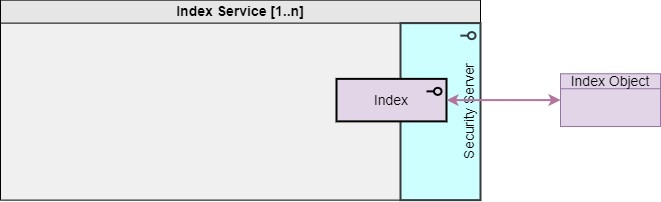

**[DARE UK Federated Architecture Blueprint](../)**      v2.2

----

# Chapter 4 Federated architecture: infrastructure layer
## 4.3 Participants
### 4.3.2 Index Service

An Index Service creates linkage spines for different Datasets. How a given service does this will depend first and foremost on the principal index key in question. For personal data, for example, the Index Service will create depersonalised linkage spines by converting between “bare” personal identifiers and project-specific linkage keys.

|  |
| ---- |

The Federation may include many Index Services, each perhaps specialising in a different kind of index.

Index Services MUST be trustworthy enough potentially to handle personal identifiers by which vertically partitioned datasets might be linked together. How indexes for such identifiers might be constructed is out of scope for this architecture. 

Index Services SHALL interact with other Federation participants solely through [Index](4_4_Interface_Types.md#445-index) interface service calls. 

----

| [< Participants: TRE](4_3_1_TRE.md) | - | [Participants: Discovery Service >](4_3_3_Discovery_Service.md) |
| ---- | ---- | ---- |

