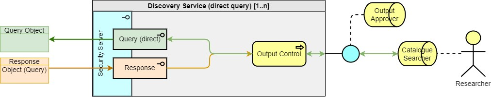

> DARE UK Federated Architecture Blueprint  v2.2
----

# Chapter 4 Federated architecture: infrastructure layer
## Participants
### Discovery Service

A Discovery Service provides information (metadata) about features of the Federation to users outside the Federation. It may achieve this by querying the Registry or other services within the Federation. 

|  |
| ---- |

The Federation may include many Discovery Services, perhaps specialising in different kinds of data.

A Discovery Service which enables dynamic discovery of metadata by querying other Federation services MUST support the outgoing [Query (direct)](4_4_Interface_Types.md#query-direct) and incoming [Response](4_4_Interface_Types.md#response) interface types. Because Query interface services encompass a range of capabilities, Discovery Services are not restricted to static lists of metadata. They can range from simple high-level data or service discoverability to dynamic cohort discovery and “Beacon-like” services [[51]](../References.md#ref-51).

This dual “inward-outward” facing role will need careful security design; any outward-facing catalogue, for instance, MUST be air gapped or otherwise isolated from any other zone within the service. We model this with an Output Control process on the outward-facing interfaces.

----

| [< Participants: Index Service](4_3_2_Index_Service.md) | - | [Participants: Job Submission Service >](4_3_4_Job_Submission_Service.md) |
| ---- | ---- | ---- |

