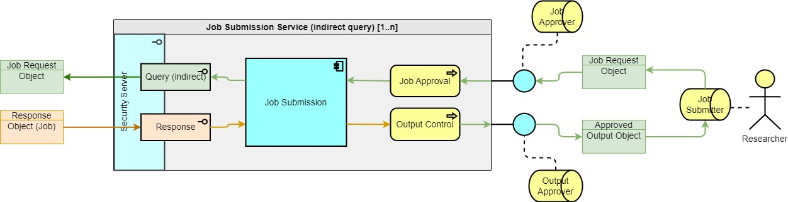

> DARE UK Federated Architecture Blueprint  v2.2
----

# Chapter 4 Federated architecture: infrastructure layer
## 4.3 Participants
### 4.3.4 Job Submission Service

A Job Submission Service combines the inward-outward facing nature of a Discovery Service with the indirect query capability of an RAZ. Job Submission Services are Federation Participants in their own rights, independent of any one TRE.

|  |
| ---- |

A Job Submission Service receives job requests from Job Submitters. These requests may need to be approved before being executed and so MUST pass through a Job Approval process overseen by a Job Approver role.

Approved job requests shall be passed to a Job Submission component which shall package them into standard Job Request Objects, forward them to the requested TREs and handle the Job Response Objects as they are returned. Handling the responses may involve composing or assembling them into a unified output object (e.g., aggregating the partial results from a federated query).

**NB**: how the requested TREs are made aware of job requests is undefined at this stage. They might choose to poll Job Submission Services that support a (currently undefined) polling interface, meaning that every TRE in the Federation might need to poll every Job Submission Service regularly. Or they might “listen” on their QMZ’s incoming [Query (indirect)](4_4_Interface_Types.md#442-query-indirect) interface, requiring this interface to be open to incoming traffic from other Federation services.

Any unified output object MUST pass through an Output Control process overseen by an Output Approver role before it can be returned to the originating Job Submitter.

A Job Submission Service MUST support the outgoing [Query (indirect)](4_4_Interface_Types.md#442-query-indirect) and incoming [Response](4_4_Interface_Types.md#443-response) interface types.

----

| [< Participants: Discovery Service](4_3_3_Discovery_Service.md) | - | [Participants: Software Service >](4_3_5_Software_Service.md) |
| ---- | ---- | ---- |

