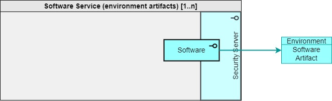
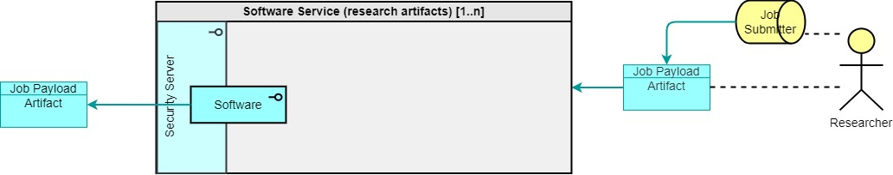

> DARE UK Federated Architecture Blueprint  v2.2
----

# Chapter 4 Federated architecture: infrastructure layer
## Participants
### Software Service

A Software Service provides access for Federation participants to sources of software from outside the Federation. 
A Software Service may:
 - act as a direct network proxy for Internet-based third-party software services (e.g., CRAN);
 - act as an independently curated, high-assurance mirror service for popular software packages (e.g., Anaconda Python Enterprise); 
 - act as a proxy for defined and approved user accounts on a public open-source software repository (e.g., GitHub);
 - act as a proxy for Researcher workflows or analytical scripts stored in external repositories (e.g., WorkflowHub) to be used as payloads for indirect queries;

and so on.

Software Services MUST support the Software interface type. 

As suggested, the Federation may have many Software Services, some specialising in particular kinds of software, language packages and so on. Two kinds are described here.

#### Environment Artifacts

|  |
| ---- |

To provision and configure Project Environments a Project Config service within a TRE’s Research Analytics Zone should connect to a Software Service (environment artifacts). This service shall act as a proxy to approved sources of “environmental software” from which to build Project Environments – a Harbour repository of assured Docker containers; an approved source of Python packages, etc.

A Software Service (environment artifacts) supplies Environment Software Artifacts to requesting TREs.

#### Research Artifacts
 
|  |
| ---- |

Indirect queries sent as Job Request Objects from Job Submission components within TREs or Job Submission Services include “pointers” to external analytics objects held in repositories, rather than actual query payloads. A Software Service (research artifacts) acts as a proxy for such external repositories, handling requests from components within TRE Query Management Zones and returning the requested research artifact (workflow, container or script, as examples) as a Job Payload Artifact.

----

| [< Job Submission Service](4_3_4_Job_Submission_Service.md) | - | [Interface types >](4_4_Interface_Types.md) |
| ---- | ---- | ---- |

