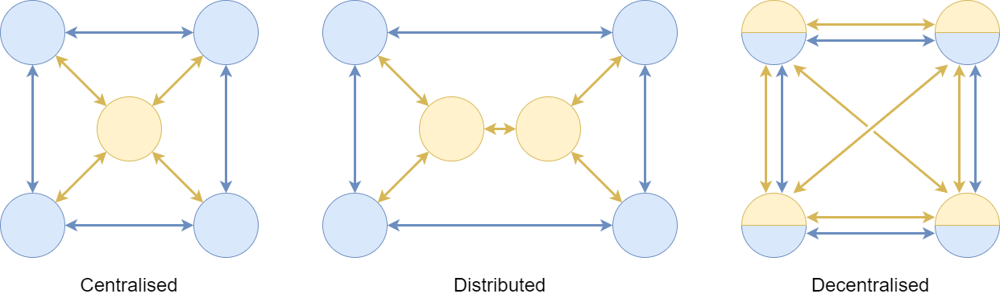
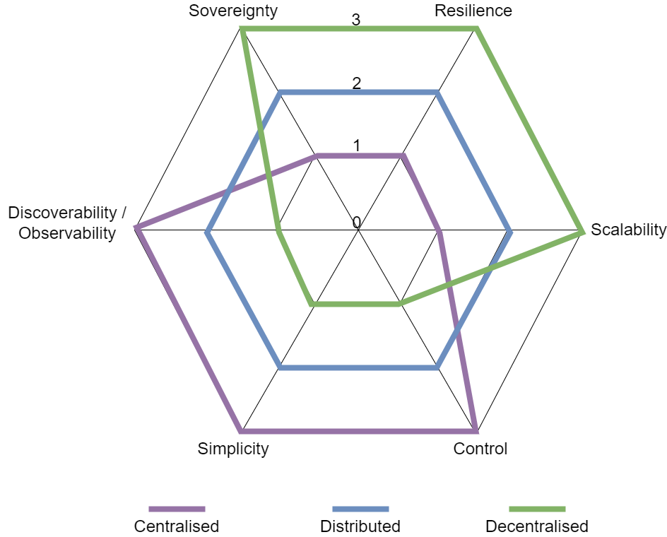

> DARE UK Federated Architecture Blueprint  v2.2
----

# Chapter 6 Federated architecture: organisational layer
## Centralised vs distributed vs decentralized

How could the Federation Authority be realised?

Chapter 3 of the “IDSA Rulebook” [[54]](../References.md#ref-54) on the creation and operation of data spaces, published by the International Data Spaces Association, offers a good discussion of the pros and cons of centralised vs de-centralised models of federated governance for Data Spaces. We adapt that discussion here for the SDRI Federation.

One way to group the key services required of an FA is as follows:
 * Rules & Policies – underpinning agreements about what joining the Federation means, and technical implementations of them that enable digital handling.
 * Trust, Identity & Certification – agents and methods for vouching for digital identities.
 * Registry (Participants) – queryable records of who is a member of the Federation.

We could also add:
 * Catalogue (data) – queryable records of what data assets could be accessible within the Federation, and how to go about applying for access.
 * Observability – records of datasets exchanged by Participants, in which Project contexts, with what authorisation.

Each of these functions of the FA could be provided using different models of centralisation. Some functions fit certain models better than others.

The diagram below shows idealised models of centralisation, from fully centralised to fully decentralised.

|  |
| ---- |

Federation Participants and data exchanges between them are shown in blue (the Federation “data plane”), while services provided by the FA are indicated in yellow (the “control plane”). We illustrate three organisational models – centralised, distributed and decentralised – that could be used to provide FA services. 

 * **Centralised.** With a centralised FA, a central node runs all required Federation Services, including services to identify, verify, onboard and register Participants. In a maximally centralised model it could also run a single data discovery catalogue for the whole Federation.
   - Every Participant requires one control-plane connection to the central FA node.
   - **Pros:** Simplicity, familiarity and maturity of implementation and operation; advantages for observability and discovery; minimal attack surface for key FA security services.
   - **Cons:** Single point of failure and single point of attack; may be viewed as ceding too much sovereignty to a single entity; a single bad-faith operator could disrupt the activities of Participants arbitrarily.
 * **Distributed.** The distributed model retains some degree of centralised control but addresses the single point of failure challenges. Functional roles are distributed among a few synchronised nodes, enabling multiple entities to share responsibility for providing FA services.
   - Every Participant requires one control-plane connection to their “nearest” FA node. “Nearest” can be interpreted in flexible ways.
   - **Pros:** Greater flexibility in service deployment over centralised; more resilient to single-node failure; more resistant to bad-faith FA actors; small attack surface for key FA security services
   - **Cons:** Technically more complex to implement and run, requiring synchronisation protocols between FA nodes; observability and discovery become more complex; only partially addresses the sovereignty issue.
 * **Decentralised.** A decentralised design creates the highest levels of autonomy and sovereignty, notably around identity. A decentralised identity system requires that each Participant maintain identity information that can be verified by other Participants in ways that meet the agreed FA rules and policies. The operation of other required FA services – notably registry – also falls to the Participants.
   - Every Participant requires one control-plane connection to every other Participant.
   - **Pros:** Maximises individual Participant sovereignty; highly resilient to single-node failure; highly resistant to bad-faith FA actors.
   - **Cons:** Technically very complex to implement and run, requiring synchronisation protocols between all Participant nodes; observability and discovery become challenging; maximal attack surface for key FA security services.

These models are not exclusive. Different models can be used for the different service functions required of the Federation and Federation Authority. Trust and identity services, for instance, could be realised centrally, while data discovery through catalogues may be much easier to realise as a distributed service or set of services.

It’s worth highlighting that the choice of model here impacts only the control plane of the Federation. Data exchange connections between Participants are the same in each case – direct and point-to-point. The functions of the control plane determine only how the connection is made, not where it goes.

Following [[54]](../References.md#ref-54), the figure below shows the three organisational models on a single radar diagram against axes representing six desirable properties.

 * **Sovereignty.** The first goal of the Federation is to improve data sharing for research while maintaining, or even enhancing, sovereignty for data providers. Sovereignty is partly a function of autonomy, trust and transparency: is the decision to share this dataset mine? Do I trust the recipient I’m sharing with? Do I retain sight of where and how my dataset is being used? In our use of the term, sovereignty sits with Federation Participants, particularly data providers, in contrast to “control” below.
 * **Resilience.** Resilience is the ability of the overall Federation ecosystem to continue functioning in the event of unforeseen problems, such as the failure of a service node.
 * **Scalability.** In Federation terms scalability is not about the volume of data exchanged but about the number of Participants and number of concurrent Projects. These factors determine the potential load upon FA services.
 * **Control.** In Federation terms, control sits in contrast to sovereignty: what level of control does the FA have over the core federation services, not only in terms of their content but also in terms of who is allowed to access them? How much “say” does the FA have over day-to-day operations within the ecosystem?
 * **Simplicity.** In terms of both building the Federation and running it, mature, well-established technologies and architecture models are easier to deploy and operate. 
 * **Discoverability / Observability.** This describes the overall transparency of the Federation, in terms of its content (essentially, the discoverability of data) and its operation (can everyone see what they need to see to retain overall trust?). 

|  |
| ---- |

